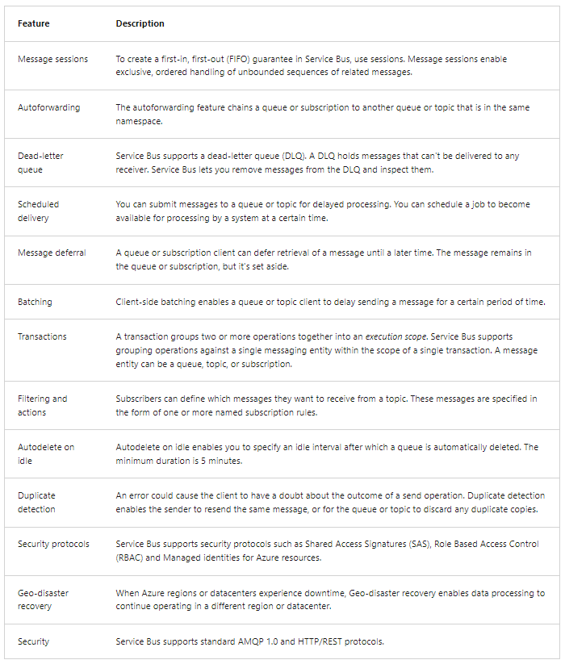

Azure supports two types of queue mechanisms: **Service Bus queues** and **Storage queues**

**Service Bus queues** 
- are part of a broader Azure messaging infrastructure that supports queuing, publish/subscribe, and more advanced 
  integration patterns
- They're designed to integrate applications or application components that may span multiple communication protocols,
  data contracts, trust domains, or network environments.

**Storage queues** 
- are part of the Azure Storage infrastructure
- They allow you to store large numbers of messages
- You access messages from anywhere in the world via authenticated calls using HTTP or HTTPS
- A queue message can be up to 64 KB in size
- A queue may contain millions of messages, up to the total capacity limit of a storage account
- Queues are commonly used to create a backlog of work to process asynchronously

## Consider using Service Bus queues
As a solution architect/developer, you should consider using Service Bus queues when:
- Your solution needs to receive messages without having to poll the queue. With Service Bus, you can achieve it by 
  using a long-polling receive operation using the TCP-based protocols that Service Bus supports
- Your solution requires the queue to provide a guaranteed first-in-first-out (FIFO) ordered delivery
- Your solution needs to support automatic duplicate detection
- You want your application to process messages as parallel long-running streams (messages are associated with a stream
  using the session ID property on the message). In this model, each node in the consuming application competes
  for streams, as opposed to messages. When a stream is given to a consuming node, the node can examine the state of 
  the application stream state using transactions
- Your solution requires transactional behavior and atomicity when sending or receiving multiple messages from a queue
- Your application handles messages that can exceed 64 KB but won't likely approach the 256-KB limit

## Consider using Storage queues
As a solution architect/developer, you should consider using Storage queues when:
- Your application must store over 80 gigabytes of messages in a queue
- Your application wants to track progress for processing a message in the queue. It's useful if the worker processing 
  a message crashes. Another worker can then use that information to continue from where the prior worker left off
- You require server side logs of all of the transactions executed against your queues

# Explore Azure Service Bus
- Microsoft Azure Service Bus is a fully managed enterprise integration message broker
- common messaging scenarios are:
  - **Messaging** - transfer business data, such as sales or purchase orders, journals, or inventory movements
  - **Decouple applications** - improve reliability and scalability of applications and services. Client and service
    don't have to be online at the same time
  - **Topics and subscriptions** - enable 1:n relationships between publishers and subscribers
  - **Message sessions** - implement workflows that require message ordering or message deferral

## Advanced features

## Compliance with standards and protocols
- The primary wire protocol for Service Bus is Advanced Messaging Queueing Protocol (AMQP) 1.0, an open ISO/IEC standard 
- It allows customers to write applications that work against Service Bus and on-premises brokers such as ActiveMQ or RabbitMQ 
- The AMQP protocol guide provides detailed information in case you want to build such an abstraction
- Service Bus Premium is fully compliant with the Java/Jakarta EE Java Message Service (JMS) 2.0 API

## Receive modes
### Receive and delete
- In this mode, when Service Bus receives the request from the consumer, it marks the message as being consumed and returns 
  it to the consumer application
- This mode is the simplest model. It works best for scenarios in which the application can tolerate not processing
  a message if a failure occurs
- For example, consider a scenario in which the consumer issues the receive request and then crashes before processing it. 
  As Service Bus marks the message as being consumed, the application begins consuming messages upon restart. 
  It will miss the message that it consumed before the crash.

### Peek lock
- In this mode, the receive operation becomes two-stage, which makes it possible to support applications that can't tolerate missing messages
1. Finds the next message to be consumed, locks it to prevent other consumers from receiving it, and then, return the 
   message to the application
2. After the application finishes processing the message, it requests the Service Bus service to complete the second 
   stage of the receive process. Then, the service marks the message as being consumed.
- If the application is unable to process the message for some reason, it can request the Service Bus service to abandon 
  the message
- Service Bus unlocks the message and makes it available to be received again, either by the same consumer or by another
  competing consumer
- Secondly, there's a timeout associated with the lock. If the application fails to process the message before the lock
  timeout expires, Service Bus unlocks the message and makes it available to be received again

## Topics and subscriptions
- Publishers send messages to a topic in the same way that they send messages to a queue But, consumers don't receive 
  messages directly from the topic. Instead, consumers receive messages from subscriptions of the topic
- A topic subscription resembles a virtual queue that receives copies of the messages that are sent to the topic

## Explore Service Bus message payloads and serialization
- Messages carry a payload and metadata
- The metadata is in the form of key-value pair properties, and describes the payload, and gives handling instructions to Service Bus and applications
- A Service Bus message consists of a binary payload section that Service Bus never handles in any form on the service-side, and two sets of properties:
  - **The broker properties** are predefined by the system
    - either control message-level functionality inside the broker, or they map to common and standardized metadata items
  - **The user properties** are a collection of key-value pairs that can be defined and set by the application

## Message routing and correlation
A subset of the broker properties described previously, specifically `To`, `ReplyTo`, `ReplyToSessionId`, `MessageId`, `CorrelationId`, and `SessionId`, 
are used to help applications route messages to particular destinations
- **Simple request/reply**
  - A publisher sends a message into a queue and expects a reply from the message consumer
  - To receive the reply, the publisher owns a queue into which it expects replies to be delivered
  - The address of that queue is expressed in the ReplyTo property of the outbound message
  - When the consumer responds, it copies the MessageId of the handled message into the CorrelationId property of the 
    reply message and delivers the message to the destination indicated by the ReplyTo property
  - One message can yield multiple replies, depending on the application context
- **Multicast request/reply** 
  - As a variation of the prior pattern, a publisher sends the message into a topic and multiple subscribers become 
    eligible to consume the message
  - Each of the subscribers might respond in the fashion described previously
  - This pattern is used in discovery or roll-call scenarios and the respondent typically identifies itself with 
    a user property or inside the payload. If ReplyTo points to a topic, such a set of discovery responses can be 
    distributed to an audience
- **Multiplexing** 
  - This session feature enables multiplexing of streams of related messages through a single queue or subscription 
    such that each session (or group) of related messages, identified by matching SessionId values, are routed to 
    a specific receiver while the receiver holds the session under lock. Read more about the details of sessions here
- **Multiplexed request/reply** 
  - This session feature enables multiplexed replies, allowing several publishers to share a reply queue
  - By setting ReplyToSessionId, the publisher can instruct the consumer(s) to copy that value into the SessionId 
    property of the reply message. The publishing queue or topic does not need to be session-aware
  - As the message is sent, the publisher can then specifically wait for a session with the given SessionId
    to materialize on the queue by conditionally accepting a session receiver

## Payload serialization
- when in transit or stored inside of Service Bus, the payload is always an opaque, binary block
- the ContentType property enables applications to describe the payload

# Explore Azure Queue Storage
- Azure Queue Storage is a service for storing large numbers of messages
- A queue message can be up to 64 KB in size
- A queue may contain millions of messages, up to the total capacity limit of a storage account
- **URL format**
  - Queues are addressable using the URL format https://<storage account>.queue.core.windows.net/<queue>
- **Storage account**
  - All access to Azure Storage is done through a storage account
- **Queue**
  - A queue contains a set of messages
- **Message**
  - A message, in any format, of up to 64 KB
  - For version 2017-07-29 or later, the maximum time-to-live can be any positive number, or -1 indicating 
    that the message doesn't expire. If this parameter is omitted, the default time-to-live is 7 days.